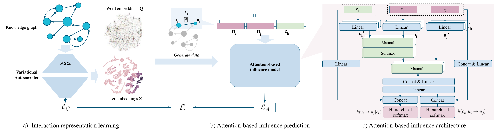
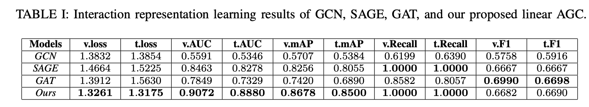
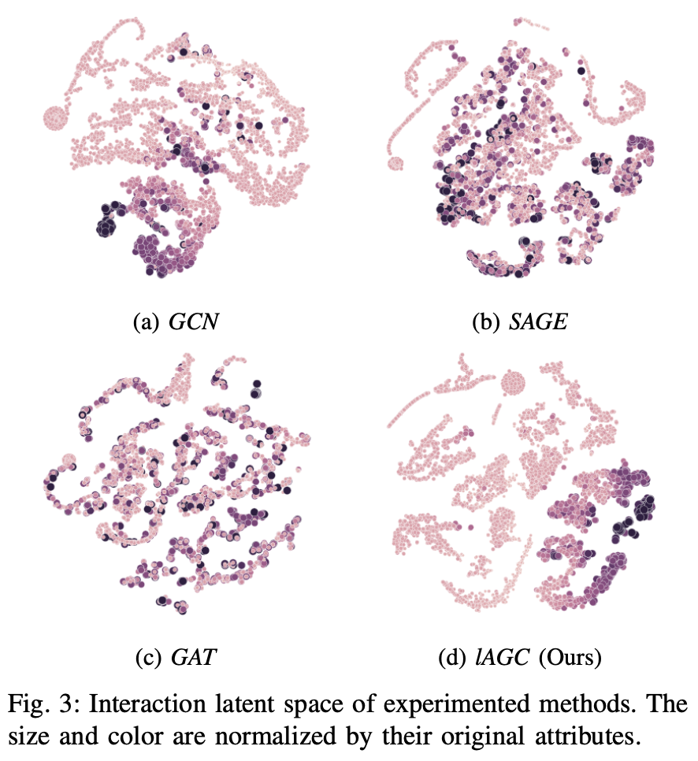
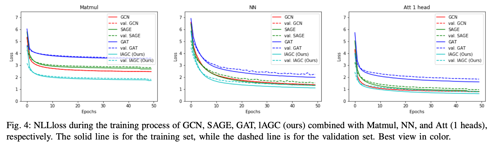
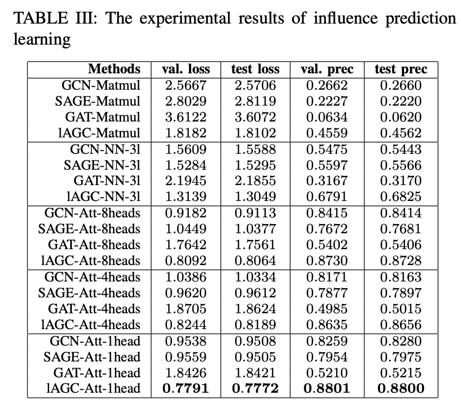
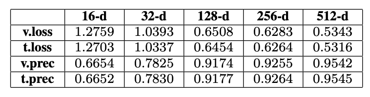

# Influence Prediction

# Overview
Implementation of paper ["Influence Prediction on Social Media Network through Contents and Interaction Behaviors using Attention-based Knowledge Graph"](https://doi.org/10.1109/KSE53942.2021.9648712)


## Abstract
This paper presents a model for predicting the
influence of information in social media networks. Given the
content, the proposed model aims to approximate the influence
of one user on another by learning from both user’s interaction
behaviors and the vast amount of content created on the network
and combining with the state-of-the-art graph convolutional and
attention-based methods. We compare the performance of the
proposed approach with other popular methods on one dataset,
manually collected from Facebook and including the real-world
interactions and contents produced by users. The experimental
results show that our approach could bypass other techniques
with competitive results and have more scalability for applying
in real-world applications, especially in influencer and content
marketing campaigns.




## Social Interaction Representation Learning
Use the linear version of [Amplified Graph Convolution](https://doi.org/10.1007/s10878-021-00815-0) (lAGC) to learn the effective representation learning. The way to construct knowledge graph and training procedure also follows this work. We compare with GCN, SAGE, GAT.

The dataset includes $9225$ users and $27442$ contents (after processing).

Experimental results



Representation visualization



## Attention-based Influence Prediction
Compare our multi-head attention-based method with popular influence prediction methods: CSIF (Matmul), NNMLInf (NN-3l)

We combine the graph models in phase 1 (Social Interaction Representation Learning) with above influence prediction methods (including ours). As a results, there are 12 combinations

Result of training progress arranged by influence prediction methods (Att 1 head is our proposed method)


Our lAGC with our Att 1 head outperforms all the others

Experimental results, we expand our attention-based methods to 4 and 8 heads additionally, the embedding size is 64



We experiment the scalability of embedding size with our 4 heads attetion-based method as follow



Increase the embedding size will increase the performance. According to this experiment, the optimal choice of embedding size can be 64 or 128


# How to run
In particular, there are following steps to calculate the AF:
1. **Transforming data**: transform raw data (from database) to structural knowledge graph data given a list of users
2. **Training model**: create the model *based on our approach*, then, the transformed data is fed to the model
3. **Encoding embedding**: Given list of users, the model encodes the corresponding data to embedding vectors. These vectos are applied to calculate the AF score
4. **Calculating AF score**: Calculate the AF score based on the embedding vector of users and our algorithm
5. **Predict post's influence**: Given a content, predict which users will be influenced

## Transfrom data

Run 
`python transform-graph.py --uidlist= --from_date= --to_date`

* `uidlist`: list of user ids on the database
* `from_date`: date to start getting the data
* `to_date`: date to complete getting the data

The `transform-graph` function produces $4$ id from the database corresponding to *edge list, node attribute, edge attribute* and *torch graph data*, respectively.

## Train model  
To train the model, run

`python train.py --graph_data_id= `

* `graph_data_id`: the id of *torch graph data*

After training, the `train` function produces the weights of model stored in database and return the id

## Encode
To encode the dedicated list of user ids, run

`python encoding.py --graph_data_id=  --model_info_id=  --gpu=  `

* `graph_data_id`: id of *torch graph data*
* `model_info_id`: if of trained model's weights
* `gpu`: `True/False` - whether to acclerate the encoding by GPU or not

After encoding, the function produces the embedding id

## Calculate AF
To calculate the amplification of a user, run

`python calaf.py --uid=  --embedding_id=  --gpu= `

* `uid`: user id to calculate the AF score 
* `embedding_id`: embedding id that contains the `uid`
* `gpu`: `True/False` - whether to acclerate the calculation by GPU or not

## Predict influence of a given post to a specific user
Setup the config in the `POST_PRED` in `config/calaf.py`, the defaul is `af_all` as follow

```
POST_PRED = {
    'af_all':
    {
        'USER_EDGE_LIST': '../files/graphdata/user_edge_list_2.hdf5',
        'CSIF_MODEL': '../files/models/model_exp2.pt',
        'NODE_DICT': '../files/graphdata/node_dict_5.hdf5',
        'USER_EMBEDDINGS': '../files/embeddings/nVGAE6_128_emb_numpy.hdf5',
        'W2V_MODEL': '../files/models/d2v.model'
    }
}
```
To calculate the probability of influence of given post from a user to another target user, run

`python pred-influence-uid.py --from-uid=   --to-uid=   --post-content=     --config=`
* `from_uid`: user to publish the content
* `to_uid`: user to measure the probability of influence
* `post_content`: the content of post
* `config`: config name in the `config/calaf.py`, if not given, the defaul will be used


# Run showcase demo

- Env: ubuntu 20.04
- prepare to run at local development
- Update system: `sudo apt-get update`
- Install packages: `sudo apt-get install gfortran libopenblas-dev liblapack-dev python3-pip python3-dev build-essential libssl-dev libffi-dev python3-setuptools python3-virtualenv`
- Make new environment: `python -m virtualenv v`
- Active the enviroment: `source v/bin/active`
- Install packages: `pip install -r requirements.txt`

- cd to `vizdemo` folder: `cd afadvo/vizdemo`
- run `app.py` file `python app.py`


