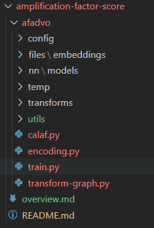

# Amplification Factor Score - Engineering Development

## 1. Overview

Amplification factor score version 1 is based on **Knowledge Graph** and **Deep Learning**. As a result, it requires data and training to accomplish.

In particular, there are following steps to calculate the AF:
1. **Transforming data**: transform raw data (from database) to structural knowledge graph data given a list of users
2. **Training model**: create the model *based on our approach*, then, the transformed data is fed to the model
3. **Encoding embedding**: Given list of users, the model encodes the corresponding data to embedding vectors. These vectos are applied to calculate the AF score
4. **Calculating AF score**: Calculate the AF score based on the embedding vector of users and our algorithm

## 2. Workers
As the current state, there are $4$ workers for the corresponding steps. All workers are *command interface*

Follow the steps below:
1.  Transfrom data

Run 
`python transform-graph.py --uidlist= --from_date= --to_date`

* `uidlist`: list of user ids on the database
* `from_date`: date to start getting the data
* `to_date`: date to complete getting the data

The `transform-graph` function produces $4$ id from the database corresponding to *edge list, node attribute, edge attribute* and *torch graph data*, respectively.

2. Train model  
To train the model, run

`python train.py --graph_data_id= `

* `graph_data_id`: the id of *torch graph data*

After training, the `train` function produces the weights of model stored in database and return the id

3. Encode
To encode the dedicated list of user ids, run

`python encoding.py --graph_data_id=  --model_info_id=  --gpu=  `

* `graph_data_id`: id of *torch graph data*
* `model_info_id`: if of trained model's weights
* `gpu`: `True/False` - whether to acclerate the encoding by GPU or not

After encoding, the function produces the embedding id

4. Calculate AF
`python calaf.py --uid=  --embedding_id=  --gpu= `

* `uid`: user id to calculate the AF score 
* `embedding_id`: embedding id that contains the `uid`
* `gpu`: `True/False` - whether to acclerate the calculation by GPU or not

## 3. Structures
The project is seperated as follows:  

* `afadvo`: the main source code
    * `transform-graph.py` (worker)
    * `train.py` (worker)
    * `encoding.py` (worker)
    * `calaf.py` (worker)

    * `config`: all configuaration files about training and database connection
    * `files`: store all related files that are overfitting to store on DB
    * `nn`: all files related to Deep Learning algorithm
        * `models`: self-implemented Deep Learning model
    * `temp`: store files that are temporarily generated by the worker process
    * `transforms`: files that transform raw data to knowledge graph. Depend on each kind of database, there will be the corresponding functions.
    * `utils`: utilities function such as database management, visualization, prediction (AF calculation function)

